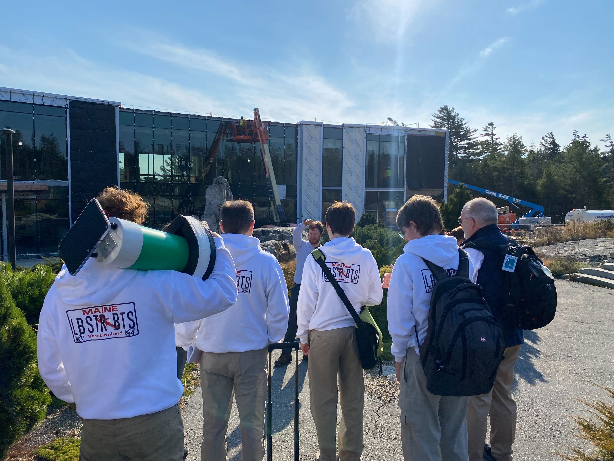

# THE LOBSTER – NEPTUNE Drifter

### Brilliant Blue 2024 Division Winners 🏆 | Built by the Lobster Bots 🦞 | Maine, USA

---

## What is THE LOBSTER?
THE LOBSTER (also known as NEPTUNE) is a solar-powered, floating sensor buoy built by students to collect real-time environmental data from the ocean—like temperature, pH, and wave motion—and beam it back to shore using LoRa. It’s open-source, modular, and designed to make ocean science more accessible.

We made it because marine monitoring gear is usually expensive and locked away in labs. Our goal was to create something affordable and open for schools, community scientists, and anyone curious about the ocean.

---

## Why It Matters
Big marine problems like ocean acidification and warming need more data—and more people collecting it. NEPTUNE helps fill that gap by putting real tools in the hands of students, teachers, and local groups. No PhD required.

---

## What It Can Do
- Measure pH, salinity, temperature, and wave height
- Log data locally and send it via LoRa
- Run on solar power for long-term deployment
- Display everything on a simple web dashboard

It’s not a commercial product—it’s DIY and proudly student-built. But it works. And it's fun.

---

## Our Brilliant Blue Win
We took THE LOBSTER to the **Brilliant Blue Challenge 2024**, competing with teams from 17 countries—and won our division. Judges called our project "an elegant and scalable solution for ocean data collection." Not bad for a group of teens from Maine with PVC pipes and a dream.

---

## Who We Are
We’re the **Lobster Bots**, a student team from Maine. We love tech, the ocean, and solving real problems. This project taught us everything from soldering to pitching a startup. It also taught us that if you care about something and put in the work—you can build something that matters.

---

## Want to Learn More?
- Read the [full project writeup (PDF)](./NEPTUNE_DRIFTER.pdf)
- View live data (link coming soon)
- Contact us or contribute right here on GitHub

> This project is open source and built for learning. Feel free to fork, remix, or reach out. Let’s make ocean science open to everyone.

**– The Lobster Bots Team** 🦞
